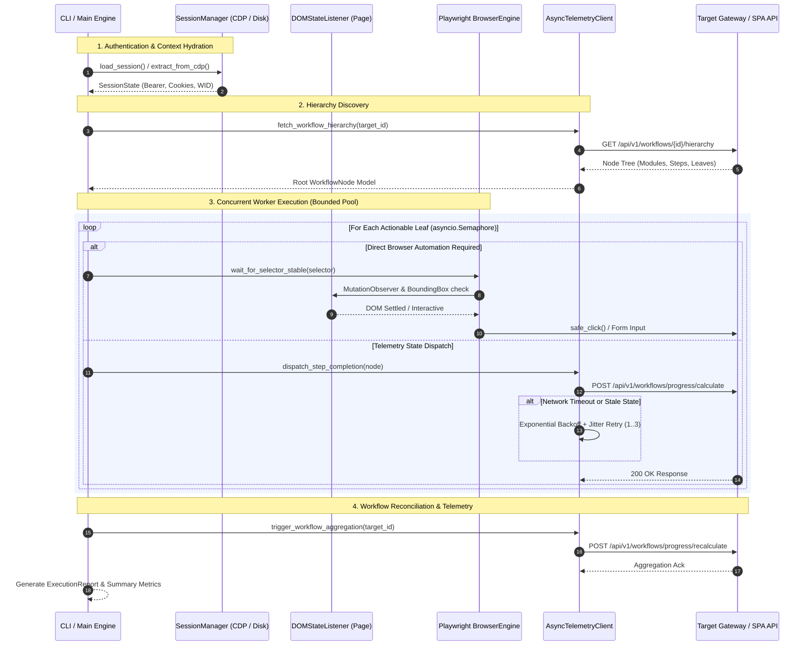

# Async Web Automation & Telemetry Engine

[](https://python.org)
[](https://playwright.dev)
[](https://opensource.org/licenses/MIT)
[](https://github.com/psf/black)
[](#architecture-overview)
[](#resilience--fault-tolerance)

> **Enterprise-grade Asynchronous Event-Driven Web Automation & Telemetry Engine** engineered for high-throughput workflow execution, single-page application (SPA) state synchronization, and resilient session orchestration.

Developed by [Kushagar Sharma](https://github.com/kushagar-debug) as a flagship demonstration of high-performance asynchronous systems, dynamic DOM lifecycle instrumentation, and cloud-ready backend telemetry.

---

## 📑 Table of Contents

- [Executive Summary](#executive-summary)
- [System Architecture](#system-architecture)
- [Key Engineering Highlights](#key-engineering-highlights)
  - [1. Bounded Concurrency & Async Multiplexing](#1-bounded-concurrency--async-multiplexing)
  - [2. Dynamic DOM Stabilization & SPA Event Instrumentation](#2-dynamic-dom-stabilization--spa-event-instrumentation)
  - [3. Exponential Backoff with Full Jitter & Circuit Breaker](#3-exponential-backoff-with-full-jitter--circuit-breaker)
  - [4. Session & Cookie State Persistence (CDP Bridge)](#4-session--cookie-state-persistence-cdp-bridge)
  - [5. Production Structured Logging & Observability](#5-production-structured-logging--observability)
- [Repository Structure](#repository-structure)
- [Quickstart Guide](#quickstart-guide)
  - [Prerequisites](#prerequisites)
  - [Installation & Virtualenv](#installation--virtualenv)
  - [Configuration (.env)](#configuration-env)
- [CLI Usage & Flag Reference](#cli-usage--flag-reference)
- [Developer & Testing Guide](#developer--testing-guide)
- [License](#license)

---

## ⚡ Executive Summary

Traditional web scrapers and automation tools often suffer from brittle synchronous loops, arbitrary `sleep()` statements, unhandled DOM stale element references, and poor credential lifecycle management.

**`async-web-automation-engine`** provides a decoupled, resilient architecture designed specifically for modern dynamic SPAs (React, Angular, Vue) and distributed API backends. It integrates:
- **Asynchronous HTTP/2 API Dispatch** (`httpx` + `asyncio`) for near-zero latency telemetry operations.
- **Async Playwright Orchestration** with in-page `MutationObserver` listeners and layout shift stability detectors.
- **Chrome DevTools Protocol (CDP)** live browser synchronization for zero-friction credential and token persistence without re-authenticating.
- **Fail-Safe Circuit Breaker** preventing cascading gateway failures during remote platform instability.

---

## 🏛️ System Architecture



---

## 💡 Key Engineering Highlights

### 1. Bounded Concurrency & Async Multiplexing
Workflow trees can contain hundreds of nested modules. Instead of blocking sequentially or exhausting socket connections with unbounded coroutines, the engine uses **`asyncio.Semaphore(max_concurrency)`** coupled with persistent connection pooling (`httpx.Limits`). This ensures maximum throughput while preserving server-side rate limits.

### 2. Dynamic DOM Stabilization & SPA Event Instrumentation
Unlike naive wait routines that rely on static delays, `DOMStateListener` injects a client-side JavaScript `MutationObserver` directly into the page runtime:
- Tracks DOM addition, removal, and subtree mutations.
- Listens to HTML5 History API events (`pushState`) to accurately recognize SPA client-side route changes.
- Monitors layout shift bounding boxes to prevent clicks while CSS animations or reactive renders are in motion.

### 3. Exponential Backoff with Full Jitter & Circuit Breaker
Every external call is protected by `@async_exponential_backoff`:
$$\text{delay} = \text{Uniform}(0.5 \times \text{base} \times f^i,\; 1.5 \times \text{base} \times f^i)$$
This eliminates synchronized retry bursts (the "thundering herd" problem). A stateful circuit breaker trips if consecutive failures exceed thresholds, pausing worker queues to prevent service degradation.

### 4. Session & Cookie State Persistence (CDP Bridge)
The `SessionManager` decouples authentication from the main automation flow:
- Evaluates active session state via Chrome DevTools Protocol (CDP) WebSocket interface on port `9222`.
- Extracts active Bearer JWTs, session tokens, and security claims without requiring plain-text passwords in memory.
- Performs offline expiration auditing via base64 JWT claim decoding (`exp`, `sub`, `wid`).
- Persists session artifacts to `.sessions/session_state.json` allowing uninterrupted workflow resumption across reboots.

### 5. Production Structured Logging & Observability
Raw `print()` statements have been replaced with a dual-handler logging subsystem:
- **ANSI Color Formatted Stream**: Real-time console readability with microsecond precision.
- **Rotating File Storage**: Traceable debugging output written to `logs/automation_engine.log` capturing line-level execution context and exception tracebacks.

---

## 📂 Repository Structure

```
async-web-automation-engine/
├── config/
│   ├── __init__.py
│   └── settings.py          # Pydantic BaseSettings & .env validation
├── core/
│   ├── __init__.py
│   ├── models.py            # Pydantic schemas (WorkflowNode, SessionState, ExecutionReport)
│   ├── session.py           # SessionManager, JWT parsing, and CDP extractor
│   ├── browser.py           # Playwright async lifecycle & resilient action handlers
│   └── telemetry_client.py  # Pooled Async HTTP client with backoff & circuit breaker
├── handlers/
│   ├── __init__.py
│   ├── dom_listener.py      # MutationObserver & SPA hydration monitor
│   └── workflow_engine.py   # Bounded concurrency task orchestrator
├── utils/
│   ├── __init__.py
│   ├── logger.py            # ANSI & file-based structured logging
│   └── retry.py             # Exponential backoff decorator with jitter
├── .env.example             # Documented sanitized configuration template
├── .gitignore               # Comprehensive git ignore rules
├── requirements.txt         # Pinned production dependencies
├── main.py                  # CLI interface with Click & execution telemetry
├── run.py                   # Canonical convenience entry point
└── sync_token.py            # Standalone CDP session synchronizer
```

---

## 🚀 Quickstart Guide

### Prerequisites
- **Python**: Version `3.10+` (Tested on `3.12`)
- **Chromium / Edge / Chrome** for optional browser orchestration or CDP extraction.

### Installation & Virtualenv

```bash
# 1. Clone repository
git clone https://github.com/kushagar-debug/async-web-automation-engine.git
cd async-web-automation-engine

# 2. Create and activate a clean virtual environment
python -m venv .venv

# On Linux/macOS:
source .venv/bin/activate
# On Windows (PowerShell):
.venv\Scripts\Activate.ps1

# 3. Install pinned dependencies
pip install -r requirements.txt

# 4. (Optional) Install Playwright browser binaries
playwright install chromium
```

### Configuration (.env)

Copy the configuration template and populate target values:

```bash
cp .env.example .env
```

Key environment properties:

```ini
TARGET_BASE_URL=https://app.target-platform.internal
AUTH_TOKEN=your_bearer_token_here
USER_ID=usr_worker_012345
MAX_CONCURRENCY=5
BROWSER_HEADLESS=true
LOG_LEVEL=INFO
```

---

## 💻 CLI Usage & Flag Reference

### General Command Syntax

```bash
python main.py [OPTIONS] [TARGET]
```

### Command-Line Flags

| Flag | Short | Default | Description |
|:---|:---:|:---:|:---|
| `--concurrency` | `-c` | `5` | Maximum number of concurrent async worker tasks. |
| `--sync-session` | `-s` | `false` | Automatically extracts authentication credentials from active browser via CDP. |
| `--validate-auth` | `-v` | `false` | Validates session token integrity and connectivity before execution. |
| `--dry-run` | `-d` | `false` | Resolves hierarchy and simulates execution without remote mutations. |
| `--log-level` | `-l` | `INFO` | Output verbosity (`DEBUG`, `INFO`, `WARNING`, `ERROR`). |
| `--help` | `-h` | - | Displays CLI usage guidelines. |

### Practical Examples

#### 1. Dry Run / Hierarchy Simulation
```bash
python main.py "https://app.target-platform.internal/workflows/wf_012345/overview" --dry-run
```

#### 2. Execute with Live CDP Token Extraction
Launch Chrome with remote debugging:
```powershell
& "C:\Program Files\Google\Chrome\Application\chrome.exe" --remote-debugging-port=9222 --user-data-dir="C:\chrome-debug"
```
Then run with `--sync-session`:
```bash
python main.py "wf_012345" --sync-session --concurrency 8
```

#### 3. Validate Cached Credentials
```bash
python main.py --validate-auth
```

---

## 🧪 Developer & Testing Guide

```bash
# Run syntax and static analysis validation
python -m py_compile main.py
python -m py_compile config/*.py core/*.py handlers/*.py utils/*.py

# Verify CLI entrypoint
python main.py --help
```

---

## 📄 License

Distributed under the [MIT License](LICENSE). Open-source for enterprise validation and academic automation research.
